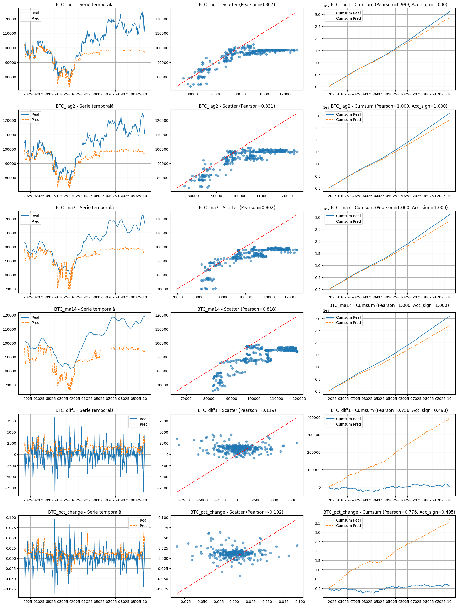

# 🪙 BTC LSTM Forecast

Acest proiect prezintă un **pipeline complet** pentru prezicerea prețului Bitcoin (BTC) folosind modele clasice de învățare automată și rețele neuronale LSTM.

---

## 📁 Structura proiectului

```
BTC_LSTM_forecast/
│
├── README.md
├── BTC_prediction.ipynb
│
├── outputs/
│   ├── rezultate_modele_clasice.csv
│   ├── rezumat_multi_target.csv
│   ├── lstm_multi_orizont.csv
│   ├── Serii_temporale_corelatii.png
│   ├── Predictii_BTC_multiscenariu_continuu.png
│   └── BTC_LSTM_performance.pptx
│
└── notebooks/
    └── (alte notebook-uri experimentale)
```

---

## ⚙️ Funcționalități principale

- **Descărcarea și preprocesarea** datelor istorice BTC și macroeconomice.  
- **Curățarea datelor:** eliminare NaN, detecție outlieri prin IQR.  
- **Feature engineering:** lag-uri, medii mobile, schimbări procentuale, volum.  
- **Modele clasice testate:** Linear Regression, Lasso, Random Forest, XGBoost, SVR, KNN.  
- **Multi-target learning:** estimarea simultană a mai multor indicatori BTC.  
- **Modele LSTM:**  
  - LSTM univariabil (BTC_close)  
  - LSTM multivariabil, multi-orizont (1, 5, 7 zile)  
- **Vizualizări și analize:**  
  - Serii temporale, corelații Pearson, Cumsum Acc-sign  
  - Predicții BTC multi-scenariu (continuu)  
- **Salvarea rezultatelor și artefactelor** în folderul `outputs/`.

---

## 📊 Vizualizări

### 1. Corelații între seriile temporale


### 2. Predicții BTC – multi-scenariu continuu


---

## 🧠 Rezultate principale

### 🔹 Modele clasice (pe setul curat)

| Model | R² | MSE |
|-------|----|------|
| Linear Regression | 1.0000 | 6.14e-31 |
| Lasso | 0.9996 | 2.62e-04 |
| Random Forest | 0.9992 | 4.98e-04 |
| XGBoost | 0.9991 | 5.98e-04 |
| SVR | 0.9860 | 9.27e-03 |
| KNN | 0.9877 | 8.15e-03 |

---

### 🔹 Multi-target (corelații și acuratețe direcțională)

| Target | Pearson | Pearson_cumsum | Acc_sign |
|---------|----------|----------------|-----------|
| BTC_lag1 | 0.807 | 0.999 | 1.000 |
| BTC_lag2 | 0.831 | 0.999 | 1.000 |
| BTC_ma7 | 0.802 | 0.999 | 1.000 |
| BTC_ma14 | 0.818 | 0.999 | 1.000 |
| BTC_diff1 | -0.119 | 0.758 | 0.498 |
| BTC_pct_change | -0.102 | 0.776 | 0.495 |

---

### 🔹 LSTM multi-orizont

| Orizont (zile) | RMSE | Acc_dir | Pearson |
|-----------------|-------|----------|----------|
| 1 | 3034.77 | 0.422 | 0.795 |
| 5 | 4980.69 | 0.476 | 0.119 |
| 7 | 7116.99 | 0.429 | -0.059 |

---

## 🧾 Prezentare PowerPoint

Prezentarea completă a pipeline-ului, vizualizărilor și rezultatelor este inclusă aici:  
📄 [`outputs/BTC_LSTM_performance.pptx`](outputs/BTC_LSTM_performance.pptx)

---

## ▶️ Cum se rulează

1. Deschide fișierul **`BTC_prediction.ipynb`** în Google Colab sau Jupyter Notebook.  
2. Instalează dependențele necesare:

```bash
pip install yfinance scikit-learn xgboost lightgbm tensorflow seaborn pandas matplotlib
```

3. Rulează toate celulele pentru a reproduce rezultatele.

---

## 📈 Concluzii

- Modelele clasice (în special RandomForest și XGBoost) ating performanțe excelente (R² > 0.999).  
- LSTM-ul oferă o predicție robustă pe termen scurt (1 zi), dar scade în precizie pentru orizonturi mai lungi (>5 zile).  
- Corelațiile ridicate între BTC și lag-urile sale sugerează **dependență temporală puternică** și posibilitatea extinderii spre modele **seq2seq** sau **Transformer** pentru forecast avansat.

---

✍️ *Autor: Bogdan Cioroiu*  
📅 *Ultima actualizare: Octombrie 2025*
